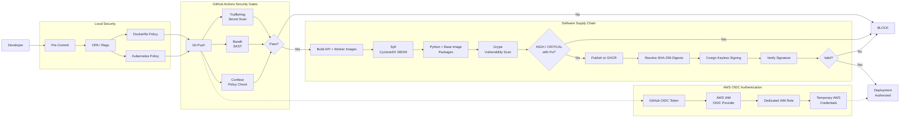

# Enterprise DevSecOps Pipeline Architecture

## Overview

This architecture implements security controls throughout the software delivery lifecycle. Security checks begin before code is committed and continue through source-code analysis, secret scanning, container creation, SBOM generation, vulnerability scanning, image signing, signature verification, and deployment authorization.

AWS authentication is performed using GitHub Actions OIDC and temporary AWS credentials instead of long-lived AWS access keys.

## Security Pipeline

## Implemented Security Controls

- **Pre-commit:** Conftest executes OPA/Rego policies before relevant Dockerfile or Kubernetes changes are committed.
- **Secret scanning:** TruffleHog scans Git history for exposed credentials and secrets.
- **SAST:** Bandit scans Python source code and blocks qualifying security findings.
- **Policy as Code:** OPA/Rego enforces non-root containers, read-only filesystems, and restrictions against `latest` image tags.
- **SBOM:** Syft generates CycloneDX SBOMs containing Python application dependencies and container base-image packages.
- **SCA:** Grype scans the generated SBOMs and blocks HIGH or CRITICAL vulnerabilities when a known fix is available.
- **Container registry:** Images that pass the security gates are published to GitHub Container Registry.
- **Image integrity:** Container images are referenced by immutable SHA-256 digest before signing.
- **Signing:** Cosign/Sigstore performs keyless signing of approved container images.
- **Deployment gate:** Cosign verification must succeed before deployment authorization can execute.
- **Cloud authentication:** GitHub Actions uses OIDC to assume a dedicated AWS IAM role and obtain temporary credentials without storing long-lived AWS access keys.

## Verification

The pipeline was tested with both positive and negative security scenarios.

A security-approved container image successfully passed the vulnerability gates, was signed with Cosign, had its signature verified, and reached the deployment authorization gate.

A separate controlled test published an intentionally unsigned container image. Cosign returned `no signatures found`, and the deployment authorization step was skipped.

AWS OIDC authentication was also validated by successfully assuming the dedicated IAM role from GitHub Actions and obtaining temporary AWS credentials.

## Current Deployment Scope

This project validates the security controls required before deployment and demonstrates secure AWS authentication using OIDC. The current implementation does not claim that an application workload was deployed to an AWS or Kubernetes production environment.